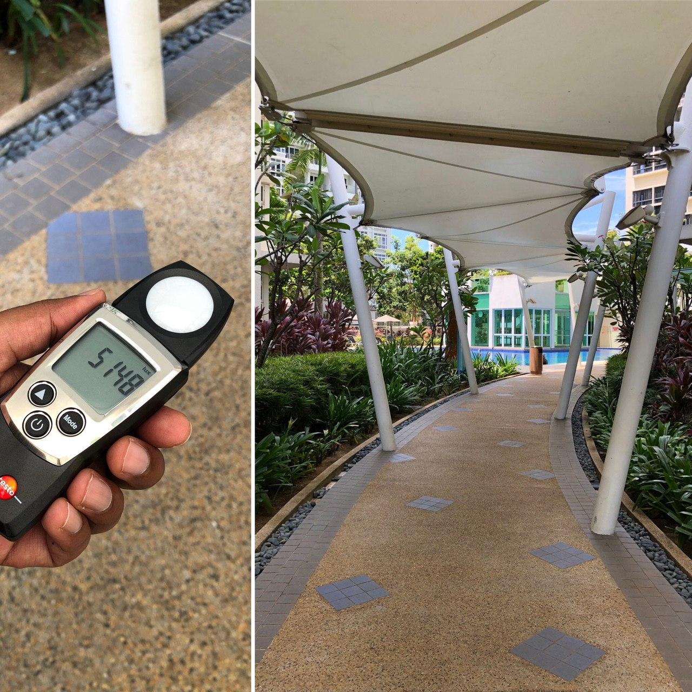

# Daylight mapping for the outdoors

What are daylight levels under a tree shade? What are daylight levels under a sail shade, PTFE, ETFE shade? What is the difference in daylight levels between a closed and an open window? To answer these and many more such questions there are two ways to go about it - we can either measure them or painstakingly model such scenarios to predict daylight levels.

A quick and easy way to start building intuition for daylight levels of our surrounding environment is to measure lux levels and share them.

**To make it as painless as possible, use the hashtag `#daylightmapping` to tag your tweets of daylight measurements (see example below).**

Once in a while, I will run a script (to be released soon!) to scrape the tweets, collect the data and make it available in this public repository. Daylight measuring instruments are expensive, sharing this information helps!

### How to post your readings on Twitter

1. Take a picture that describes the context you are measuring and a picture of the reading on sensor.

2. Describe your observation in the tweet with as many of the following attributes as you can:
  - **Hashtag `#daylightmapping`** (this one is mandatory!)
  - Time of the day
  - Month
  - Sky condition (clear sky, cloudy sky, overcast)
  - Location, either manually or allow your tweet to be geotagged (in this case, post the tweet from where you took the picture)
  - Lux levels

### Example

Text | Picture
---|---
5000 lux under a white sail shade when the sun is overhead on a **clear day, 12pm, March, Singapore**. Direct sun is blocked, pleasant shade and sufficient daylight for an outdoor walkway in an equatorial climate @testolimited **#daylightmapping** [(Tweet link)](https://twitter.com/prijipriji) | 

### Project details

#### Objectives

The goals of this experiment are twofold:

1. Develop daylight level intuition for designers around the world, based on shared material over an open platform.
2. An opportunity for mixing a qualitative analysis with quantitative methods, described in the next section.

#### Methodology

The tweets contain two items:

- **The description:** Depending on how rich the descriptions in our dataset are, it may make sense to run a sentiment analysis and observe how various environments are experienced by our data collectors. Other methods may try and "understand" as much from the description as possible, e.g., recognise date information or lux levels from the text alone.
- **The picture:** Also depending on the quality of collected pictures, image recognition algorithms can be used to infer properties of the image and key elements (a shade, a pool, the sky, trees).

